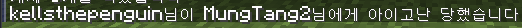
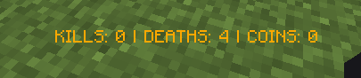

# Pit
간단한 난투장 플러그인

## 명령어
### /kitcreate <킷 이름>
킷을 생성하는 명령어입니다. 인벤토리를 복사하여 킷을 생성합니다.

### /pit <킷 이름>
더핏에 해당 킷으로 참가하는 명령어입니다.

## 기능
### 사망 시 메시지 변경
  
위 사진처럼 사망 메시지를 변경할 수 있습니다.  
(사진은 참고용이며 실제 저 닉네임을 가진 유저와는 관련이 없습니다.)

### 액션바
  
액션바를 커스텀할수 있습니다.  
아래는 액션바에 사용할 수 있는 템플릿 문자들입니다.

| 문자  | 설명         |
|-----|------------|
| @k  | 죽인 플레이어의 수 |
| @d  | 얼마나 죽었는지   |
| @c  | 코인         |
